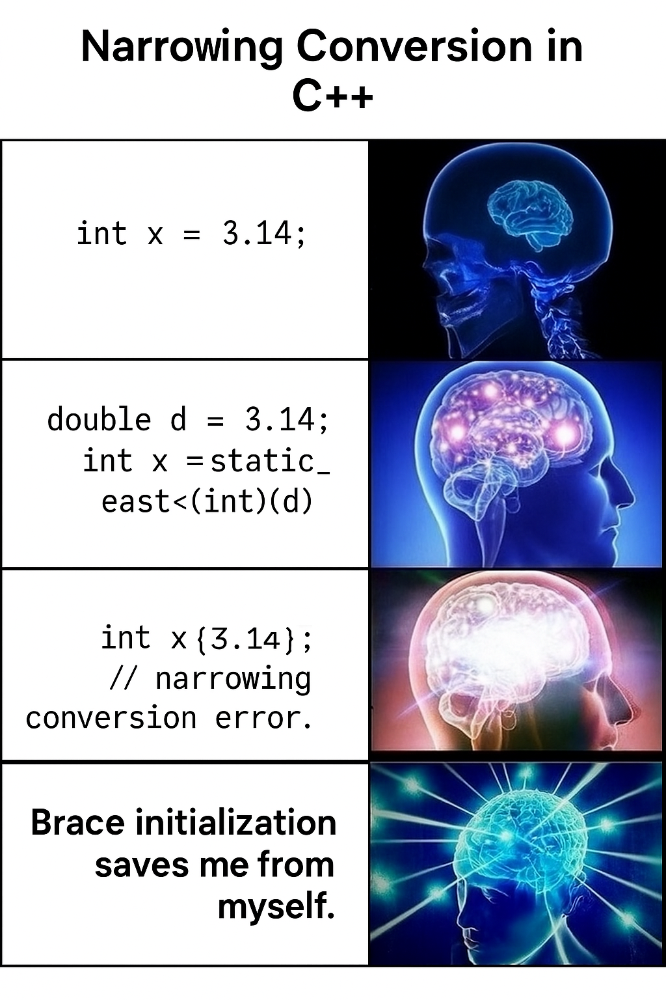

# Initialization & References Lecture Code

## Overview
In this folder you'll find that there is code for the code that was in the lecture slides for your perusal.
We encourage you to take a look at this and play around with the code, try to break it, etc. This is where
the real learning really happens.

## To Compile
Not to make you fetch-quest but take a look at the lecture for information on how to do this, it should be relatively
simple. We really want you to get comfortable with compiling C++ programs from the terminal/command line.

